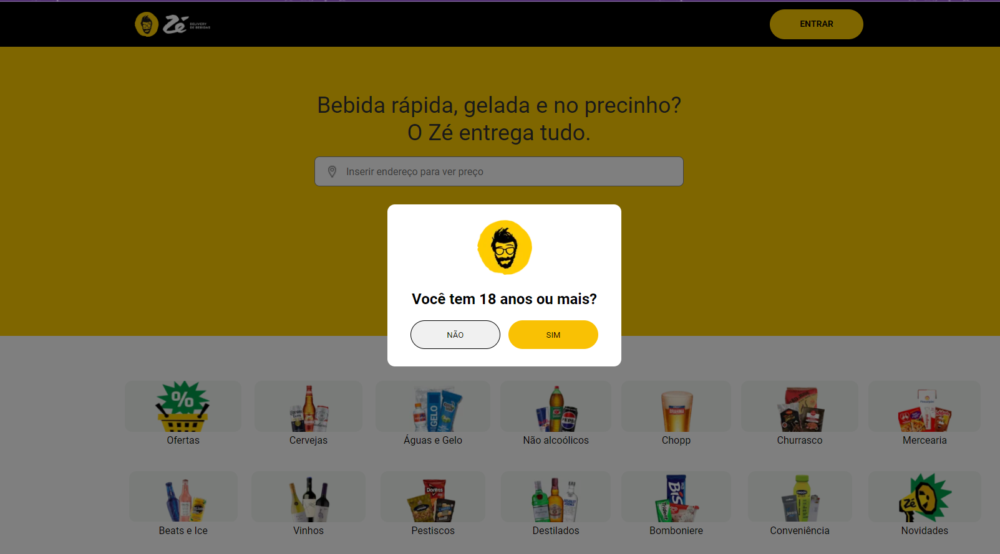

# Clone Zé Delivery 🚀

Este é um projeto de um site clone do [Zé Delivery](https://www.ze.delivery/), desenvolvido utilizando **React** com **Vite**. O objetivo foi recriar funcionalidades e layout semelhantes ao site original, permitindo a navegação e a experiência do usuário fluida, com foco no aprendizado e no desenvolvimento de habilidades front-end.



[Acesse o projeto clone aqui](https://zedeliveryclone.vercel.app/)


## 🛠️ Tecnologias utilizadas

- **React** com **Vite** para uma aplicação mais rápida e eficiente
- **React Router Dom** para gerenciar as rotas e a navegação entre as páginas
- **Swiper** para criar slides de produtos e banners de forma dinâmica e interativa
- Modais personalizados para melhorar a usabilidade, incluindo um modal inicial de boas-vindas
- Efeitos visuais e animações para uma experiência mais agradável e moderna

## 💡 Funcionalidades

- Modal de início que aparece ao carregar o site
- Slides interativos de produtos e promoções utilizando o Swiper
- Navegação intuitiva entre diferentes seções do site
- Layout responsivo e dinâmico, inspirado no Zé Delivery


## ⚙️ Como rodar o projeto

1. Clone o repositório:
   ```bash
   git clone https://github.com/seu-usuario/ze-delivery-clone.git

2. Instale as dependências:
   ```bash
   npm install
   
3. Rode a aplicação:
   ```bash
    npm run dev

## 📞 Contato

Para dúvidas, sugestões ou colaborações, você pode entrar em contato comigo através dos seguintes meios:

- **E-mail:** daianearruda90@gmail.com
- **LinkedIn:** [Daiane Arruda](https://www.linkedin.com/in/daianearruda)
   
